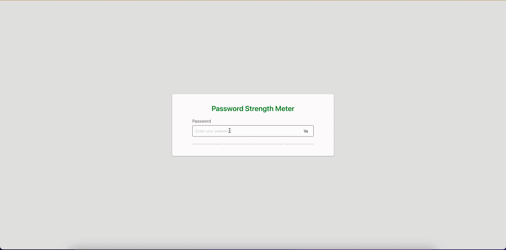

# React TypeScript Password Strength Meter

A password strength meter using react-password-strength-bar library is built with React, Typescript, Styled-components and webpack.

      
      
      
      
      
      
      

### Instructions

- Fork repository and clone it to your machine
- Install Nodejs if you haven't installed it yet
- Install dependencies

      yarn install

- Run the application

      yarn start

### Live App

